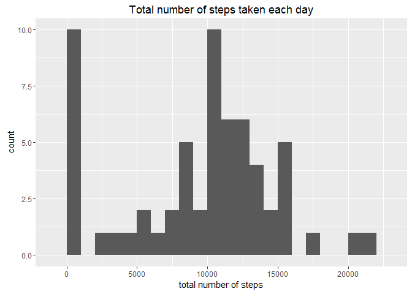
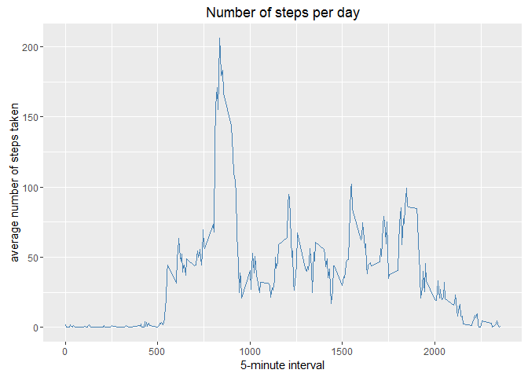
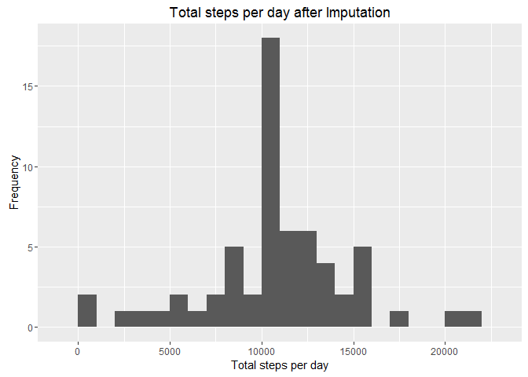
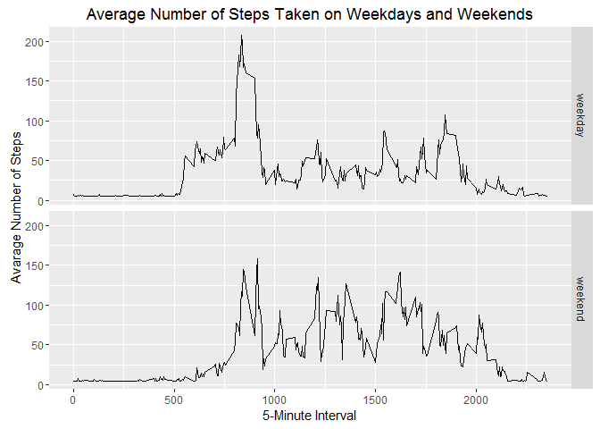

# Reproducible Research: Peer Assessment 1


## Loading and preprocessing the data


```r
file<-file.path(getwd(),"activity.zip")
unzip(file)
dataset <- read.csv("activity.csv")
dataset$date <- as.Date(dataset$date)

library(ggplot2)
library(Hmisc)
```

```
## Loading required package: lattice
```

```
## Loading required package: survival
```

```
## Loading required package: Formula
```

```
## 
## Attaching package: 'Hmisc'
```

```
## The following objects are masked from 'package:base':
## 
##     format.pval, round.POSIXt, trunc.POSIXt, units
```

## What is mean total number of steps taken per day?


```r
totalSteps <- tapply(dataset$steps, dataset$date, sum, na.rm=TRUE)
```
###1. Make a histogram of the total number of steps taken each day

```r
qplot(totalSteps, binwidth=1000, xlab="total number of steps", main="Total number of steps taken each day")
```



###2. Calculate the mean and median total number of steps taken per day


```r
mean(totalSteps, na.rm=TRUE)
median(totalSteps, na.rm=TRUE)
```

###:: Mean

```
## [1] 9354.23
```

###:: Median

```
## [1] 10395
```

## What is the average daily activity pattern?


```r
averageDaily <- aggregate(x=list(steps=dataset$steps), by=list(interval=dataset$interval), mean, na.rm=TRUE)
```


```r
ggplot(averageDaily, aes(x=interval, y=steps)) +
  geom_line(color="steelblue") + 
    labs(x="5-minute interval", y="average number of steps taken", title="Number of steps per day")
```




## Imputing missing values

###1. Calculate the total number of missing values in the dataset

```r
sum(is.na(dataset$steps))
```

```
## [1] 2304
```

###2. Devise a strategy for filling in all of the missing values in the dataset.
Because of the presence of missing days (NA) may introduce bias, the mean was imputed. 

###3. Create a new dataset that is equal to the original dataset but with the missing data filled in.

```r
datasetNew <- dataset
datasetNew$steps <- impute(dataset$steps, mean)
```

###4. Make a histogram of the total number of steps taken each day

```r
totalStepsNew <- tapply(datasetNew$steps, datasetNew$date, sum)
qplot(totalStepsNew, xlab='Total steps per day', ylab='Frequency', main="Total steps per day after Imputation", binwidth=1000)
```



###5. Calculate the mean and median total number of steps taken per day after Imputation

```r
mean(totalStepsNew)
median(totalStepsNew)
```

###:: Mean

```
## [1] 10766.19
```

###:: Median

```
## [1] 10766.19
```

## Are there differences in activity patterns between weekdays and weekends?
###1. Create a new factor variable in the dataset with two levels - "weekday" and "weekend" indicating whether a given date is a weekday or weekend day.

```r
#datasetNew$dateType<-ifelse(as.POSIXlt(activityDataImputed$date)$wday %in% c(0,6), "weekday", "weekend")
#datasetNew
datasetNew$dateType <-  ifelse(as.POSIXlt(datasetNew$date)$wday %in% c(0,6), 'weekend', 'weekday')
```

###2. Make a panel plot containing a time series plot

```r
averageNew<-aggregate(steps ~ interval + dateType, datasetNew, mean)
ggplot(averageNew, aes(interval, steps)) + 
    geom_line() + 
    facet_grid(dateType ~ .) +
    xlab("5-Minute Interval") + 
    ylab("Avarage Number of Steps") +
    ggtitle("Average Number of Steps Taken on Weekdays and Weekends")
```


